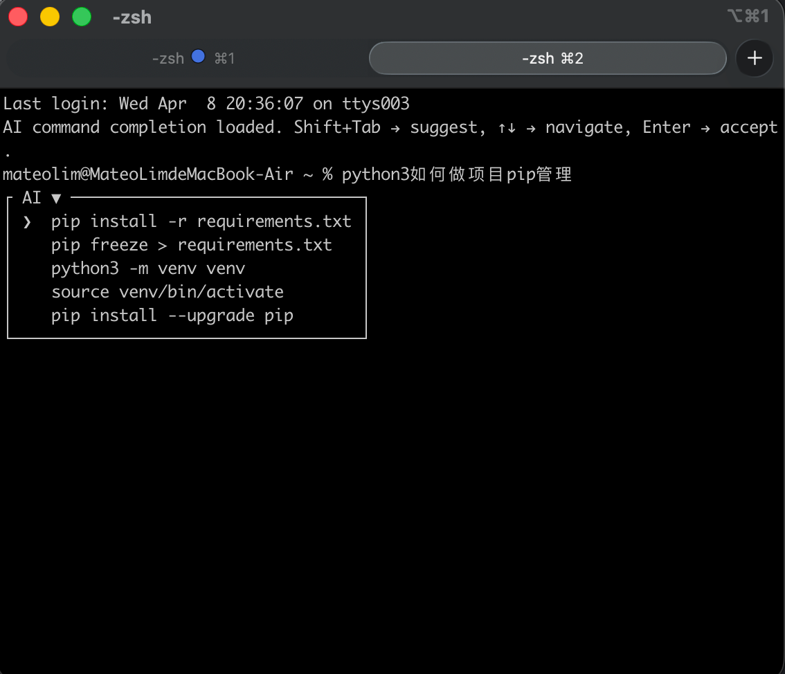
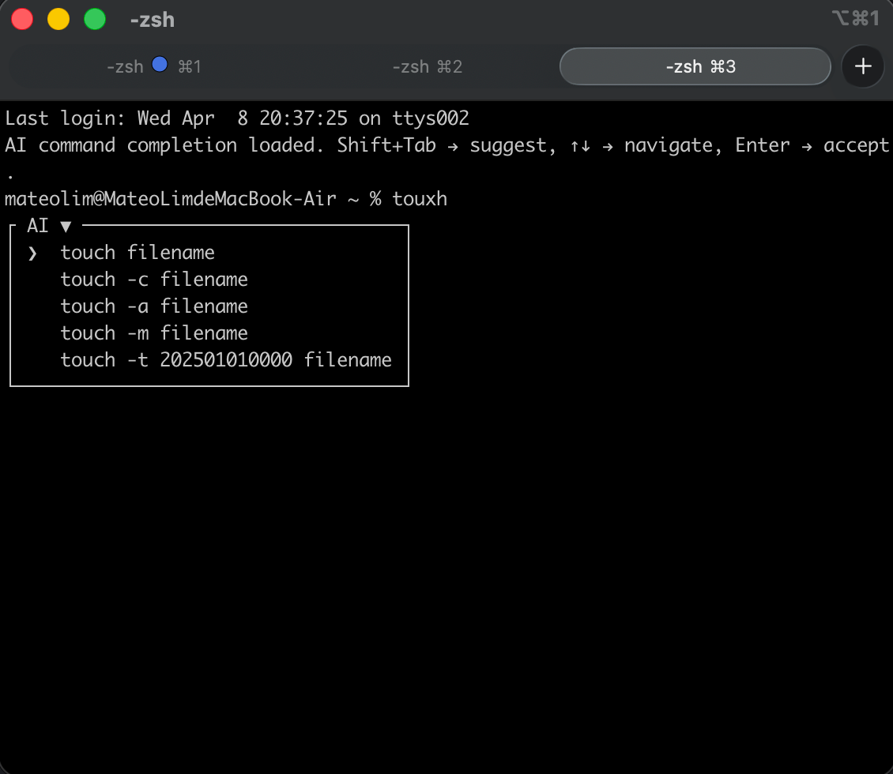
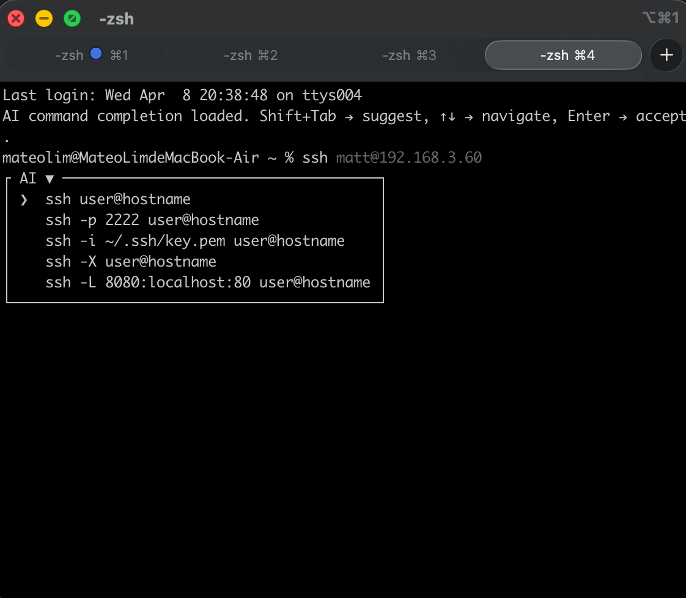

# TerminalTab

TerminalTab 是一个轻量的 zsh 插件。

它会在你输入命令后，通过 `Shift+Tab` 调用大模型 API，返回一组选好的完整命令建议，适合用来：
- 修正拼写错误
- 补全半截命令
- 为已有命令推荐常用参数组合

## 特性

- `Shift+Tab` 触发 AI 建议
- 垂直边框菜单展示结果
- `↑ / ↓` 切换高亮
- `Enter` 接受当前建议
- `Ctrl+C` 取消菜单并恢复原始输入
- 加载中动画直接显示在当前输入后面
- 建议结果会自动清洗：去重、去编号、去项目符号、去代码块残留
- 仅依赖 `curl` 和 `jq`

## 示例







## 原理

TerminalTab 的工作流程很简单：

1. 你在命令行里输入内容后按 `Shift+Tab`
2. `ai-complete.zsh` 读取当前输入，并在后台调用 `ai-suggest`
3. `ai-suggest` 请求大模型，让它返回“每行一条”的完整命令建议
4. 返回结果会在本地再次清洗，过滤掉空行、编号、项目符号、代码块残留和重复项
5. 清洗后的结果交给 zsh 插件渲染成可选择的建议列表
6. 你可以用 `↑ / ↓` 切换，用 `Enter` 把选中的命令填回当前输入框

也就是说：这个项目不是直接替你执行命令，而是把大模型输出整理成更适合直接使用的命令候选，再交给你选择。

## 文件说明

- `ai-complete.zsh`：zsh 插件，负责键位绑定、菜单渲染、状态管理
- `ai-suggest`：Bash 脚本，负责请求大模型并清洗输出

## 依赖

请先确保系统已安装：

```bash
brew install jq curl
```

如果系统已自带 `curl`，通常只需要安装 `jq`。

## 安装

1. 克隆仓库：

```bash
git clone https://github.com/scsfwgy/TerminalTab
cd TerminalTab
```

2. 在 `~/.zshrc` 中加入配置：

```bash
export AI_COMPLETE_API_KEY="sk-..."
export AI_COMPLETE_MODEL="gpt-4o-mini"
export AI_COMPLETE_API_URL="https://api.openai.com/v1/chat/completions"
export AI_COMPLETE_MAX_ITEMS=5

source /path/to/TerminalTab/ai-complete.zsh
```

举例

```deepseek 举例
export AI_COMPLETE_API_KEY="sk-ebfbeed****854700044d"
export AI_COMPLETE_API_URL="https://api.deepseek.com/v1/chat/completions"
export AI_COMPLETE_MODEL="deepseek-chat"
                                                                                                         
source ~/TerminalTab/ai-complete.zsh  
```

3. 重新加载 shell：

```bash
source ~/.zshrc
```

## 使用方式

输入命令后按：

- `Shift+Tab`：请求 / 刷新 AI 建议
- `↑ / ↓`：切换高亮项
- `Enter`：接受当前高亮建议
- `Ctrl+C`：取消菜单并恢复输入

示例：

```bash
ls
```

按下 `Shift+Tab` 后，可能得到：

```bash
ls -la
ls -lh
ls -lt
ls -lS
```

如果输入的是拼写错误，例如：

```bash
toush
```

按下 `Shift+Tab` 后，可能得到：

```bash
touch filename
touch -c filename
touch -a filename
```

## 运行测试

项目内置了几个简单的回归测试。

直接运行：

```bash
./test.sh
```

当前会执行：
- navigation buffer regression
- ai-suggest cleanup regression
- shift+tab binding regression
- trigger rename regression

## 适配其它 API

如果你使用的是兼容 OpenAI 的第三方接口，只要它支持 Chat Completions 风格请求，通常只需要改：

```bash
export AI_COMPLETE_API_URL="https://your-api.example.com/v1/chat/completions"
export AI_COMPLETE_MODEL="your-model"
```

## 注意事项

- 本插件依赖 zsh 的 ZLE 机制，不适用于 bash
- 某些终端或 tmux 配置可能会改写 `Shift+Tab` 转义序列；如果发现按键无效，需要先确认终端是否发送 `^[[Z`
- `Tab` 本身未被占用，仍可保留给原生补全或其它插件

## License

MIT
